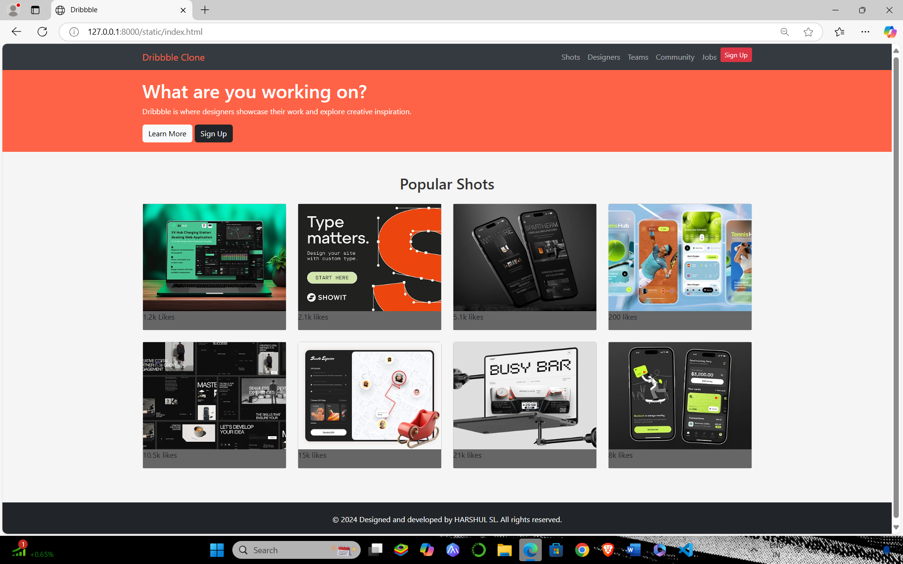

# Project Responsive Web Design using Bootstrap
## Date:23/12/24

## AIM:
To create a simplified clone of Dribbble (https://dribbble.com/) landing page.


## DESIGN STEPS:

### Step 1:
Clone the repository from GitHub.

### Step 2:
Create Django Admin project.

### Step 3:
Create a New App under the Django Admin project.

### Step 4:
Insert the necessary CSS and JavaScript files as external in order to use Bootstrap.

### Step 5:
Create a HTML file and include the needed Bootstrap components.

### Step 6:
Publish the website in the LocalHost.

## PROGRAM :
```
<!DOCTYPE html>
<html lang="en">
<head>
    <meta charset="UTF-8">
    <meta name="viewport" content="width=device-width, initial-scale=1.0">
    <title>Dribbble</title>
    <link href="https://cdn.jsdelivr.net/npm/bootstrap@5.3.0/dist/css/bootstrap.min.css" rel="stylesheet">
    <script src="https://kit.fontawesome.com/a076d05399.js" crossorigin="anonymous"></script>
</head>
<body style="background-color: #f5f5f5; color: #333;">
    <nav class="navbar navbar-expand-lg navbar-dark" style="background-color: #343a40;">
        <div class="container">
            <a class="navbar-brand" href="#" style="color: #ff6347;">Dribbble Clone</a>
            <button class="navbar-toggler" type="button" data-bs-toggle="collapse" data-bs-target="#navbarNav">
                <span class="navbar-toggler-icon"></span>
            </button>
            <div class="collapse navbar-collapse" id="navbarNav">
                <ul class="navbar-nav ms-auto">
                    <li class="nav-item"><a class="nav-link" href="#">Shots</a></li>
                    <li class="nav-item"><a class="nav-link" href="#">Designers</a></li>
                    <li class="nav-item"><a class="nav-link" href="#">Teams</a></li>
                    <li class="nav-item"><a class="nav-link" href="#">Community</a></li>
                    <li class="nav-item"><a class="nav-link" href="#">Jobs</a></li>
                    <li class="nav-item"><a class="btn btn-danger btn-sm btn-signup" href="#">Sign Up</a></li>
                </ul>
            </div>
        </div>
    </nav>

    <div class="hero" style="background-color: #ff6347; color: white; padding: 20px 0;">
        <div class="container">
            <h1>What are you working on?</h1>
            <p>Dribbble is where designers showcase their work and explore creative inspiration.</p>
            <a href="#" class="btn btn-light">Learn More</a>
            <a href="#" class="btn btn-dark">Sign Up</a>
        </div>
    </div>

    <div class="container my-5">
        <h2 class="text-center mb-4">Popular Shots</h2>
        <div class="row gallery">
            <div class="col-md-3 mb-4">
                <div class="card">
                    
                    <div class="overlay" style="background-color: rgba(0, 0, 0, 0.6);">
                        <i class="fas fa-heart" style="color: #ff6347;"></i>
                        <p>1.2k Likes</p>
                    </div>
                </div>
            </div>
            <div class="col-md-3 mb-4">
                <div class="card">
                    
                    <div class="overlay" style="background-color: rgba(0, 0, 0, 0.6);">
                        <i class="fas fa-heart" style="color: #ff6347;"></i>
                        <p>2.1k likes</p>
                    </div>
                </div>
            </div>
            <div class="col-md-3 mb-4">
                <div class="card">
                    
                    <div class="overlay" style="background-color: rgba(0, 0, 0, 0.6);">
                        <i class="fas fa-heart" style="color: #ff6347;"></i>
                        <p>5.1k likes</p>
                    </div>
                </div>
            </div>
            <div class="col-md-3 mb-4">
                <div class="card">
                    
                    <div class="overlay" style="background-color: rgba(0, 0, 0, 0.6);">
                        <i class="fas fa-heart" style="color: #ff6347;"></i>
                        <p>200 likes</p>
                    </div>
                </div>
            </div>
            <div class="col-md-3 mb-4">
                <div class="card">
                    
                    <div class="overlay" style="background-color: rgba(0, 0, 0, 0.6);">
                        <i class="fas fa-heart" style="color: #ff6347;"></i>
                        <p>10.5k likes</p>
                    </div>
                </div>
            </div>
            <div class="col-md-3 mb-4">
                <div class="card">
                    
                    <div class="overlay" style="background-color: rgba(0, 0, 0, 0.6);">
                        <i class="fas fa-heart" style="color: #ff6347;"></i>
                        <p>15k likes</p>
                    </div>
                </div>
            </div>
            <div class="col-md-3 mb-4">
                <div class="card">
                    
                    <div class="overlay" style="background-color: rgba(0, 0, 0, 0.6);">
                        <i class="fas fa-heart" style="color: #ff6347;"></i>
                        <p>21k likes</p>
                    </div>
                </div>
            </div>
            <div class="col-md-3 mb-4">
                <div class="card">
                    
                    <div class="overlay" style="background-color: rgba(0, 0, 0, 0.6);">
                        <i class="fas fa-heart" style="color: #ff6347;"></i>
                        <p>8k likes</p>
                    </div>
                </div>
            </div>
        </div>
    </div>

    <footer id="contact" class="bg-dark text-white text-center py-4">
        <div class="container">
            <p class="mb-0">&copy; 2024 Designed and developed by HARSHUL SL. All rights reserved.</p>
        </div>
    </footer>

    <script src="https://cdn.jsdelivr.net/npm/bootstrap@5.3.0/dist/js/bootstrap.bundle.min.js"></script>
</body>
</html>

```

## OUTPUT:



## RESULT:
The Project for responsive web design using Bootstrap is completed successfully.
